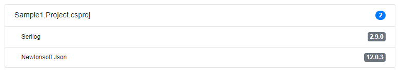
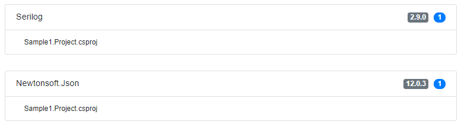

# nuget-collector
SPA to collect information about nuget references being used by multiple GIT repositories. Usually helpful for microservice oriented applications. 

 

This view shows the different repositories used for the analysis.

 

This view shows some reference stats.

 

This view shows all projects found which nuget references.

 

This view shows all references being used at different projects.



This view shows all references grouped by version being used at different projects. Helpful to consolidate references.


### Project setup

## Backend

Since the application uses EntityFramework Core on top of SqlLite, create the database by calling:

```
Update-Dabase
```

Configure your GIT repository settings:

```
"CollectorOptions": {
    "LocalPath": "[WORKING_DIRECTORY]",
    "ViaHttp": false,
    "Credential": {
      "Username": "[GIT_USERNAME]",
      "Password": "[GIT_PASSWORD]",
      "Email": "[GIT_EMAIL]"
    },
    "Repositories": [
      {
        "Name": "[GIT_REPOSITORY_NAME]",
        "Path": "[GIT_REPOSITORY_PATH]"
      }
    ]
  }
```

At the moment the application supports both GIT clones via filesystem or HTTP/S. If cloning / pulling from filesystem **Credential.Password** is not required.


## Frontend


```
npm install
```

### Compiles and hot-reloads for development
```
npm run serve
```

### Compiles and minifies for production
```
npm run build
```

### Lints and fixes files
```
npm run lint
```